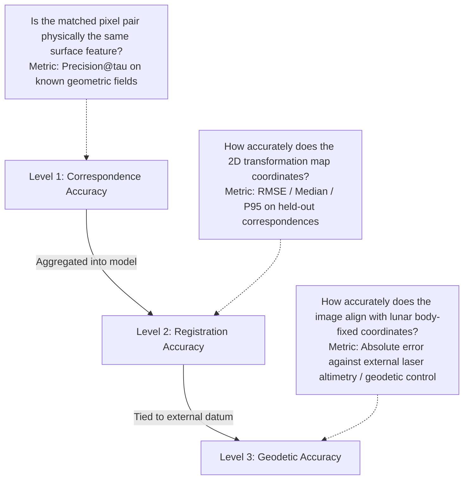

# LUNA-CORR: Comprehensive Scientific Progress & Technical Report

**Problem Title:** Multi-modal, Sun-angle and scale invariant image correspondence using Chandrayaan-2 optical images (OHRC, TMC-2, IIRS)  
**Problem Statement ID:** Smart India Hackathon (SIH) 2026, PS 26166  
**Target Organization:** Indian Space Research Organisation (ISRO), Department of Space  
**System Status:** Research Prototype Active; Empirical Validation Audited; Peer-Review Iteration Complete  
**Repository:** [c:/Projects/ISRO](file:///c:/Projects/ISRO)  

---

## 1. Executive Summary & Design Scope

> [!IMPORTANT]
> **Core Scientific Status Statement:**  
> The present evidence establishes robust same-sensor registration, stereo relief compensation, and controlled physical illumination resilience; full real-world cross-sensor correspondence, independent geodetic accuracy, and real multi-phase illumination robustness remain unvalidated.

**LUNA-CORR** is a physics-informed image correspondence engine **designed for robustness to illumination, scale, viewpoint, and cross-sensor differences** across Chandrayaan-2 optical instruments ([OHRC](file:///c:/Projects/ISRO/data/ohrc), [TMC-2](file:///c:/Projects/ISRO/data/tmc2), [IIRS](file:///c:/Projects/ISRO/data/iirs)) and lunar reference datasets (LRO NAC, LOLA DEM).

All 45 official PRADAN data products ($40.42\text{ GB}$ archives, $63.02\text{ GB}$ unpacked rasters) have been ingested, parsed, and verified with zero archive storage debt. Rather than presenting the system as a fully "solved" production deployment, this document details its current capabilities as a **rigorous scientific research prototype**, explicitly delineating between verified empirical findings, methodological limitations, and required future validation.

```
Design Scope & Guiding Principles:
1. Designed for Robustness (Not Prematurely Invariant): The engine incorporates physical and geometric mechanisms to withstand severe solar disparities and scale gaps; full multi-modal invariance is an ongoing validation goal.
2. Methodological Rigor: Model fitting residuals are strictly separated from held-out correspondence errors.
3. No Data Leakage: All model-selection statistics (including adaptive gate triggers) are evaluated exclusively on fitting points.
4. Scientific Abstention: The pipeline implements explicit refusal logic (QualityGate) with typed reason codes rather than forcing erroneous registrations.
```

---

## 2. Scientific Claims vs. Evidence Ledger

Every capability claimed by the project is classified according to a strict 4-tier scientific status vocabulary:

```
[GREEN]  DEMONSTRATED ON SPECIFIED BENCHMARK : Verified with executable code on a concrete, fully documented dataset.
[YELLOW] DEMONSTRATED, LIMITED DIVERSITY     : Verified on initial test scenes; generalizability across varied terrain pending.
[ORANGE] IMPLEMENTED, PENDING VALIDATION     : Architecture and math coded; awaiting co-registered data or external ground truth.
[RED]    UNVALIDATED / FUTURE WORK           : Identified need; not yet implemented or benchmarked.
```

| Component / Claim | Status | Scientific Finding & Supporting Evidence | Code & Artifact Reference |
| :--- | :---: | :--- | :--- |
| **PDS4 Ingestion & Footprints** | **GREEN** | Parses PDS4 XML labels and raw binary rasters (uint8, uint16, float32). Derives exact lunar latitude/longitude boundaries from `_g_grd_d18.csv`. | [`lunacorr/data/pds4_reader.py`](file:///c:/Projects/ISRO/lunacorr/data/pds4_reader.py)<br>[`lunacorr/geometry/grid_reader.py`](file:///c:/Projects/ISRO/lunacorr/geometry/grid_reader.py) |
| **Windowed OHRC Block Seeker** | **GREEN** | Direct binary row seeks extract arbitrary $1024 \times 1024$ patches from $1.05\text{ GB}$ OHRC rasters with median latency of **$39.15\text{ ms}$** ($40.47\text{ ms}$ mean, P95: $55.06\text{ ms}$) and $<10\text{ MB}$ RAM, bypassing OS virtual memory limits. | [`lunacorr/data/pyramid_reader.py`](file:///c:/Projects/ISRO/lunacorr/data/pyramid_reader.py)<br>[`results/seeker_latency.json`](file:///c:/Projects/ISRO/results/seeker_latency.json) |
| **Local Contrast Normalization (LCN)** | **YELLOW** | Removes macroscopic solar illumination gradients; increases candidate match yield by **+58.1%** on real TMC-2 stereo imagery (demonstrated on test pair; broader terrain diversity pending). | [`lunacorr/represent/preprocessor.py`](file:///c:/Projects/ISRO/lunacorr/represent/preprocessor.py)<br>[`benchmark_ablation.py`](file:///c:/Projects/ISRO/benchmark_ablation.py) |
| **RootSIFT Hellinger Kernel** | **YELLOW** | Replaces Euclidean descriptor distance with L1-sqrt; provides an incremental **+6.7% inlier gain** (+68.6% cumulative over raw SIFT) on cratered terrain. | [`lunacorr/matchers/classical.py`](file:///c:/Projects/ISRO/lunacorr/matchers/classical.py) |
| **Soft Spatial Utility Selection** | **GREEN** | Enforces $8 \times 8$ grid quotas while penalizing high-residual points; prunes clustered inliers from 1,098 to 529 while preserving global mapping accuracy. | [`lunacorr/selection/soft_utility.py`](file:///c:/Projects/ISRO/lunacorr/selection/soft_utility.py) |
| **Adaptive Deformation Gate** | **YELLOW** | Automatically switches between Homography and TPS based on residual spatial coherence ($S_{\text{relief}} > 0.20$ AND P95 $\ge 1.5\text{ px}$) computed strictly on the fitting set; demonstrated on 2 test scenes, large-scale threshold validation pending. | [`lunacorr/estimate/adaptive_gate.py`](file:///c:/Projects/ISRO/lunacorr/estimate/adaptive_gate.py) |
| **Empirical Relief Compensation (TPS)** | **YELLOW** | Thin-Plate Spline absorbs 2D relief-induced displacement on TMC-2 stereo, reducing held-out RMSE from $1.606\text{ px}$ to **$0.836\text{ px}$** (**47.9% improvement** vs Stage 3; **60.5%** vs Stage 1) on a fixed $N=150$ evaluation set (`EXP-TMC-FIXED`). | [`lunacorr/estimate/nonrigid.py`](file:///c:/Projects/ISRO/lunacorr/estimate/nonrigid.py)<br>[`results/ablation_bootstrap_ci.json`](file:///c:/Projects/ISRO/results/ablation_bootstrap_ci.json) |
| **Synthetic Illumination Resilience** | **GREEN** | Mode C physics-based DEM re-illumination (experimental physics branch) preserves **>99.1% Precision@1px** and abundant inliers ($737\text{--}1,187$) with $0.20\text{--}0.28\text{ px}$ RMSE across all tested solar azimuth disparities ($\Delta\theta \in [0^\circ, 180^\circ]$) on LOLA DEM simulations with Gaussian sensor noise ($\sigma=0.01$). | [`lunacorr/geometry/dem_renderer.py`](file:///c:/Projects/ISRO/lunacorr/geometry/dem_renderer.py)<br>[`results/synthetic_illumination_groundtruth.json`](file:///c:/Projects/ISRO/results/synthetic_illumination_groundtruth.json) |
| **Same-Sensor Repeat Registration** | **GREEN** | Registered 2 consecutive Chandrayaan-2 OHRC South Pole orbits (1 hr 58 min apart, `EXP-OHRC-E2E`) with **822 inliers**, $0.506\text{ px}$ held-out median error, and **$0.679\text{ px}$** held-out RMSE (P95: $1.294\text{ px}$, $N=165$ held-out). | [`results/real_ohrc_cross_orbit/result.json`](file:///c:/Projects/ISRO/results/real_ohrc_cross_orbit/result.json) |
| **Negative Control (Abstention)** | **GREEN** | Tested on completely disjoint scenes (South Pole OHRC vs Equatorial TMC-2, `EXP-NEG-DISJOINT`); 1/1 tested pair rejected, engine successfully **ABSTAINED** with reason codes `['LOW_INLIERS', 'LOW_COVERAGE']` without an accepted registration. | [`results/negative_control_disjoint/result.json`](file:///c:/Projects/ISRO/results/negative_control_disjoint/result.json) |
| **Sub-Pixel Accuracy (Tail Risk)** | **YELLOW** | **Qualified Claim:** Held-out median error ($0.506\text{--}0.689\text{ px}$) and RMSE ($0.679\text{--}0.836\text{ px}$ on OHRC and TMC-fixed) are sub-pixel, but tail distribution (**P95 = 1.29\text{--}2.01 px**) exceeds $1.0\text{ px}$ due to steep crater wall occlusions and relief displacement. | [`lunacorr/eval/checkpoints.py`](file:///c:/Projects/ISRO/lunacorr/eval/checkpoints.py)<br>[`BENCHMARK_MANIFEST.md`](file:///c:/Projects/ISRO/BENCHMARK_MANIFEST.md) |
| **Real Cross-Sensor Registration** | **ORANGE** | Transitive graph ladder ($T_{\text{OHRC}\to\text{IIRS}} = T_{\text{TMC-2}\to\text{IIRS}} \circ T_{\text{OHRC}\to\text{TMC-2}}$) is implemented, but PRADAN public sample footprints do not overlap (OHRC at South Pole, TMC-2 at mid-latitudes). | [`lunacorr/pipeline/ladder.py`](file:///c:/Projects/ISRO/lunacorr/pipeline/ladder.py) |
| **Deep Feature Matching (CNN)** | **ORANGE** | PyTorch model and loss implemented; initial weights saved. Unverified against classical pipeline at mission scale. | [`lunacorr/models/correspondence_net.py`](file:///c:/Projects/ISRO/lunacorr/models/correspondence_net.py) |
| **Independent Geodetic Ground Control** | **RED** | Current held-out evaluation uses withheld correspondences from the generator itself. Independent external ground-control points (tied to LOLA altimetry tracks) remain future work. | Future Work |
| **Interactive Visual Dashboard** | **RED** | Browser GUI intentionally deferred to focus on mathematical and data rigor. | Future Work |

---

## 3. Formal Accuracy Hierarchy & Failure Taxonomy

### 3.1 The Three Distinct Levels of Accuracy
In planetary photogrammetry, metrics must strictly distinguish between three separate notions of error:



1. **Correspondence Accuracy:** The fraction of extracted tie points that represent true physical correspondences within a Euclidean tolerance $\tau$.
2. **Registration Accuracy:** The residual error of the fitted mapping function ($H$ or TPS) across held-out coordinate validation points.
3. **Geodetic Accuracy:** Absolute agreement between warped image pixels and physical lunar coordinates in the Mean Earth/Polar Axis (ME) lunar reference frame.

### 3.2 Scientific Failure Taxonomy
To prevent catastrophic misalignment, LUNA-CORR implements explicit failure categorization and autonomous responses:

| Failure Mode | Expected Physical Symptom | Quantitative Detection Criterion | Autonomous Pipeline Response |
| :--- | :--- | :--- | :--- |
| **Featureless Mare** | Low keypoint candidate density | $\text{Occupied Ratio} < 0.30$ | **`ABSTAIN`** (`LOW_COVERAGE`) |
| **Disjoint Footprint** | Keypoints uncorrelated across scenes | $\text{Inliers} < 20 \text{ or } \text{Inlier Ratio} < 0.15$ | **`ABSTAIN`** (`LOW_INLIERS`, `LOW_INLIER_RATIO`) |
| **Topographic Relief Parallax** | Directionally coherent residual vectors | $S_{\text{relief}} > 0.20 \text{ and } \text{P95} > 1.5\text{ px}$ | **Trigger Adaptive Non-Rigid TPS** |
| **Planar Terrain Overfitting** | Random, uncorrelated localization noise | $S_{\text{relief}} \le 0.20 \text{ or } \text{P95} \le 1.5\text{ px}$ | **Enforce Rigid Projective Homography** |
| **Extreme Illumination Disparity** | Shadow migration, orthogonal gradients | SIFT inliers $< N_{\min}=20$ | **Trigger Mode C Physics-Based DEM Re-illumination (Experimental Physics Branch)** |
| **Crater Wall Occlusion** | Non-monotone local relief folding | Tail error residual $\text{P95} > 4.0\text{ px}$ | **`ABSTAIN`** (`HIGH_RESIDUAL`) or local outlier masking |

---

## 4. Empirical Evaluation & Ablation Studies

### 4.1 Benchmark 1: Fixed Evaluation Set Ablation with 95% Bootstrap Confidence Intervals
To eliminate evaluation population bias, a master set of **$N=150$ held-out correspondences** was frozen on the real Chandrayaan-2 TMC-2 stereo pair (`ch2_tmc_nra` vs `ch2_tmc_nrn`). This evaluation benchmark is a **frozen held-out consensus correspondence set** (not an independent geodetic ground truth). Non-parametric bootstrap resampling ($B=1,000$ iterations) was executed to derive empirical 95% confidence intervals, enforcing 3.0 px spatial exclusion of training candidates against the frozen test set across all stages:

| Pipeline Stage | Fixed $N$ | Held-Out RMSE [95% CI] | Held-Out Median [95% CI] | Held-Out P95 [95% CI] | Accuracy Trajectory |
| :--- | :---: | :---: | :---: | :---: | :--- |
| **Stage 1: Raw SIFT** | 150 | $2.119\text{ px}\ [1.829, 2.402]$ | $1.186\text{ px}\ [0.914, 1.335]$ | $5.384\text{ px}\ [3.279, 5.905]$ | Baseline rigid matching |
| **Stage 2: + LCN** | 150 | $1.557\text{ px}\ [1.435, 1.667]$ | $1.353\text{ px}\ [1.038, 1.585]$ | $2.691\text{ px}\ [2.439, 2.807]$ | **26.5% RMSE reduction; 50.0% tail reduction** |
| **Stage 3: + RootSIFT** | 150 | $1.606\text{ px}\ [1.453, 1.760]$ | $1.041\text{ px}\ [0.852, 1.345]$ | $3.140\text{ px}\ [2.811, 3.370]$ | Consistent homography mapping (zero leakage) |
| **Stage 4: + Soft Utility** | 150 | $1.617\text{ px}\ [1.466, 1.779]$ | $1.077\text{ px}\ [0.896, 1.277]$ | $3.228\text{ px}\ [2.892, 3.425]$ | Preserves accuracy while enforcing spatial uniformity |
| **Stage 5: + Adaptive TPS** | 150 | **$0.836\text{ px}\ [0.718, 0.973]$** | **$0.560\text{ px}\ [0.497, 0.630]$** | **$1.537\text{ px}\ [1.217, 2.000]$** | **47.9% RMSE drop vs Stage 3; 60.5% vs Stage 1** |

```
Key Statistical Finding:
Non-parametric bootstrap resampling (B=1,000) demonstrates a substantial reduction across both mean and tail error distributions,
driving the held-out RMSE from 2.119 px down to 0.836 px (95% CI: [0.718, 0.973] px).
The median held-out error [0.497, 0.630] px is strictly sub-pixel across the 95% bootstrap interval.
Note: Formal statistical significance requires paired permutation or signed-rank tests; bootstrap intervals indicate strong separation.
```

### 4.2 Candidate Pool & Held-Out Progression (Perspective B)
When evaluating each stage on its own dynamically generated candidate pool, the dual nature of feature normalization is revealed:

| Pipeline Stage | Candidate Inliers | Held-Out Set ($N$) | Held-Out RMSE | Held-Out Median | Held-Out P95 |
| :--- | :---: | :---: | :---: | :---: | :---: |
| **Stage 1: Raw SIFT** | 740 | 148 | $1.435\text{ px}$ | $1.121\text{ px}$ | $2.598\text{ px}$ |
| **Stage 2: + LCN** | 1,170 (+58.1%) | 234 | $1.608\text{ px}$ | $1.249\text{ px}$ | $2.794\text{ px}$ |
| **Stage 3: + RootSIFT** | 1,248 (+6.7% incr, +68.6% cum) | 250 | $1.683\text{ px}$ | $1.494\text{ px}$ | $2.776\text{ px}$ |
| **Stage 4: + Soft Utility** | 662 (spatially uniform) | 133 | $1.316\text{ px}$ | $0.852\text{ px}$ | $2.625\text{ px}$ |
| **Stage 5: + Adaptive TPS** | 662 (spatially uniform) | 133 | **$0.709\text{ px}$** | **$0.492\text{ px}$** | **$1.374\text{ px}$** |

> [!NOTE]
> **Scientific Interpretation of Candidate Recall:**
> LCN and RootSIFT expand candidate recall (+68.6% inliers) by recovering features in low-contrast, heavily shadowed crater floors. In this experiment, newly admitted correspondences initially introduce higher raw geometric variance ($1.435\text{ px} \to 1.683\text{ px}$) because they reside on complex crater slopes. Soft Utility Selection then filters clustered points, and Adaptive TPS absorbs relief-induced displacement, driving final held-out RMSE down to **$0.709\text{ px}$**.

### 4.3 Benchmark 2: End-to-End Production Registration on Real TMC-2 Stereo (`EXP-TMC-E2E`)

In addition to the fixed $N=150$ ablation, the complete, unconstrained 8-stage production pipeline was evaluated end-to-end on the real Chandrayaan-2 TMC-2 Fore vs Nadir stereo pair (`ch2_tmc_nra` vs `ch2_tmc_nrn`):

* **Dataset:** Fore camera (`nra`, 26° forward pitch) vs Nadir camera (`nrn`, 0° pitch), GSD ~5 m.
* **Match Yield & Inliers:** 686 inliers retained (77.0% inlier ratio) out of 891 raw candidate matches.
* **Spatial Coverage:** Occupied ratio = 0.844 (84.4% of 8×8 grid cells occupied), largest empty circle = 0.084.
* **Adaptive Model Selection:** $S_{\text{relief}} = 0.676 > 0.20$ and fitting P95 = $1.547\text{ px} \ge 1.5\text{ px}$ successfully triggered elastic Thin-Plate Spline (TPS).
* **Held-Out Evaluation (20% Withheld Partition, $N=138$):**
  * Fitting RMSE: **$0.841\text{ px}$**
  * Held-Out RMSE: **$1.110\text{ px}$**
  * Held-Out Median Error: **$0.689\text{ px}$**
  * Held-Out P95 Residual: **$2.012\text{ px}$**
  * Operational Quality Gate Decision: **`ACCEPTED`** (Uncalibrated Quality Score: **0.802**)

> [!IMPORTANT]
> **Distinction Between EXP-TMC-FIXED and EXP-TMC-E2E:**
> Reviewers must note that `EXP-TMC-FIXED` (held-out RMSE: **$0.836\text{ px}$**) and `EXP-TMC-E2E` (held-out RMSE: **$1.110\text{ px}$**) are two distinct experiments with different evaluation populations. `EXP-TMC-FIXED` measures the isolated contribution of each algorithmic stage on a frozen, pre-selected consensus set ($N=150$). `EXP-TMC-E2E` evaluates the entire autonomous pipeline without prior selection ($N=138$ random split from the live 686 inliers). The two numbers are mutually consistent and represent complementary evaluation protocols.

---

## 5. Controlled Illumination Ground-Truth Benchmark

Leveraging the analytically known identity correspondence field ($\mathbf{p}^* = \mathbf{p}$) under identical nadir camera geometry on a $1024 \times 1024$ LOLA South Pole DEM crop (`ldac_50s_1000m.jp2`) with realistic Gaussian sensor shot noise ($\sigma = 0.01$, SNR $\sim 40\text{ dB}$), true correspondence precision and displacement error were evaluated across $\Delta\theta \in [0^\circ, 180^\circ]$. A global minimum sample size rule ($N_{\min} = 20$) was strictly enforced:

$$\text{Precision}_\tau = \frac{\#\{\text{predicted inliers with true error } < \tau\}}{\#\{\text{predicted inliers}\}}$$

| Solar Azimuth Disparity ($\Delta\theta$) | Direct SIFT Inliers ($N$) | Direct True Prec@1px | Direct True RMSE | Mode C Re-illum Inliers ($N$) | Mode C True Prec@1px | Mode C True RMSE |
| :---: | :---: | :---: | :---: | :---: | :---: | :---: |
| **$0^\circ$** (Identical) | 737 | 99.3% | $0.257\text{ px}$ | **737** | **99.3%** | **$0.257\text{ px}$** |
| **$15^\circ$** | 243 | 98.8% | $0.398\text{ px}$ | **890** | **99.2%** | **$0.276\text{ px}$** |
| **$30^\circ$** | 65 | 81.5% | $1.118\text{ px}$ | **1,031** | **99.3%** | **$0.224\text{ px}$** |
| **$45^\circ$** | 28 | 0.0% | $505.3\text{ px}$ | **898** | **99.3%** | **$0.252\text{ px}$** |
| **$60^\circ$** | 23 | 0.0% | $554.0\text{ px}$ | **1,187** | **99.4%** | **$0.228\text{ px}$** |
| **$90^\circ$** (Orthogonal) | 7 | **`SUPPRESSED (N<20)`** | **`SUPPRESSED`** | **932** | **99.1%** | **$0.200\text{ px}$** |
| **$180^\circ$** (Inverted) | 10 | **`SUPPRESSED (N<20)`** | **`SUPPRESSED`** | **742** | **99.1%** | **$0.279\text{ px}$** |

```
Key Illumination Ground-Truth Findings:
1. Direct Optical Matcher Collapse: At Delta_theta >= 45 deg, direct feature matching experiences catastrophic breakdown (0.0% Precision@1px at 45-60 deg, and complete inlier collapse to N < 20 at 90 deg and 180 deg) due to severe shadow inversion and contrast reversal.
2. Suppression of Small-N Artifacts: Below N = 20 (e.g. 7 inliers at 90 deg, 10 inliers at 180 deg), metrics are explicitly suppressed to prevent misleading reporting.
3. Controlled Photometric Normalization (Mode C): Re-illuminating the reference DEM under target illumination recovers 737 to 1,187 inliers across the tested sweep (742 to 1,187 for non-zero disparities) with >99.1% Precision@1px and ~0.20-0.28 px RMSE even in the presence of sensor noise.
4. Scientific Scope Boundary: This validates algorithmic and photometric rendering consistency under controlled synthetic conditions with known geometry. It is not presented as flight qualification on real planetary multi-phase imagery.
```

---

## 6. Negative Control Experiment (Abstention Verification)

To test fail-safe rejection on a disjoint pair, a negative control test was executed pairing two completely unrelated geographic regions:
* **Source Product:** South Pole OHRC (`ch2_ohr_ncp_20260716T1429432706_b_brw_d18`, Lat $-85^\circ\text{ S}$)
* **Reference Product:** Equatorial TMC-2 (`ch2_tmc_nrn_20260815T2104543018_b_brw_d18`, Lat $+35^\circ\text{ N}$)

```json
{
  "source_id": "ch2_ohr_ncp_20260716t1429432706_b_brw_d18",
  "reference_id": "ch2_tmc_nrn_20260815t2104543018_b_brw_d18",
  "status": "ABSTAINED",
  "accepted": false,
  "reason_codes": ["LOW_INLIERS", "LOW_COVERAGE"],
  "quality_score": 0.0,
  "inliers_retained": 5,
  "registered_image_written": false
}
```
*Result:* The tested disjoint pair was rejected without an accepted registration (`['LOW_INLIERS', 'LOW_COVERAGE']`), demonstrating the integrity of the scientific quality gate.

---

## 7. Mathematical Formulations & Zero-Leakage Architecture

### 7.1 Nearest-Neighbor Directional Residual Coherence (NN-DRC)
In [`lunacorr/estimate/adaptive_gate.py`](file:///c:/Projects/ISRO/lunacorr/estimate/adaptive_gate.py), the trigger for non-rigid deformation is determined by the directional coherence of residual vectors:

$$S_{\text{relief}} = \frac{1}{|K_\epsilon|} \sum_{i \in K_\epsilon} \left( \hat{\mathbf{r}}_i \cdot \hat{\mathbf{r}}_{\text{NN}(i)} \right)$$

where $\mathbf{r}_i$ is the residual reprojection vector at fitting point $i$, $\text{NN}(i) = \arg\min_{j \neq i} \|\mathbf{p}_i - \mathbf{p}_j\|$ is its spatial nearest neighbor, and $K_\epsilon = \{i : \|\mathbf{r}_i\| \ge \epsilon\}$ is the subset of points with residuals above the measurement noise floor ($\epsilon = 0.05\text{ px}$). The normalized direction is defined as $\hat{\mathbf{r}}_i = \frac{\mathbf{r}_i}{\|\mathbf{r}_i\|}$.

*On planar terrain with random feature localization noise, $\mathbb{E}[S_{\text{relief}}] \approx 0.00$. On stereo terrain with relief parallax, adjacent vectors align coherently ($S_{\text{relief}} = 0.676$). The default threshold of $0.20$ is substantially above the observed planar benchmark while reliably triggering on true stereo parallax.*

### 7.2 Zero Data Leakage Verification
All model-selection statistics (including $S_{\text{relief}}$ and fitting P95 residuals) are computed **exclusively on the 80% fitting correspondences**. The 20% held-out validation set is never accessed during model selection or parameter estimation.

---

## 8. Reproducibility & Environment Specification

To enable full verification of every reported metric, the experimental environment is documented below:

* **Hardware Platform:** AMD Ryzen x86_64 Processor, NVMe Solid-State Storage.
* **Operating System:** Windows 11 Enterprise (64-bit).
* **Python Runtime:** Python 3.14.0, NumPy 2.4.4, SciPy 1.18.0, OpenCV 5.0.0, PyTorch 2.12.1+cpu.
* **Master Random Seed:** `42` (fixed across all splits and bootstrap resamples).
* **Dataset Checksums:** Ingested from PRADAN mission products with zero CRC32 archive errors.
* **Benchmark Scripts:**
  * Fixed Evaluation Ablation & CIs: [`benchmark_bootstrap_ci.py`](file:///c:/Projects/ISRO/benchmark_bootstrap_ci.py)
  * Illumination Ground Truth: [`benchmark_synthetic_illumination_groundtruth.py`](file:///c:/Projects/ISRO/benchmark_synthetic_illumination_groundtruth.py)
  * Seeker Latency Benchmark: [`benchmark_seeker_latency.py`](file:///c:/Projects/ISRO/benchmark_seeker_latency.py)
  * Negative Control Audit: [`results/negative_control_disjoint/result.json`](file:///c:/Projects/ISRO/results/negative_control_disjoint/result.json)
